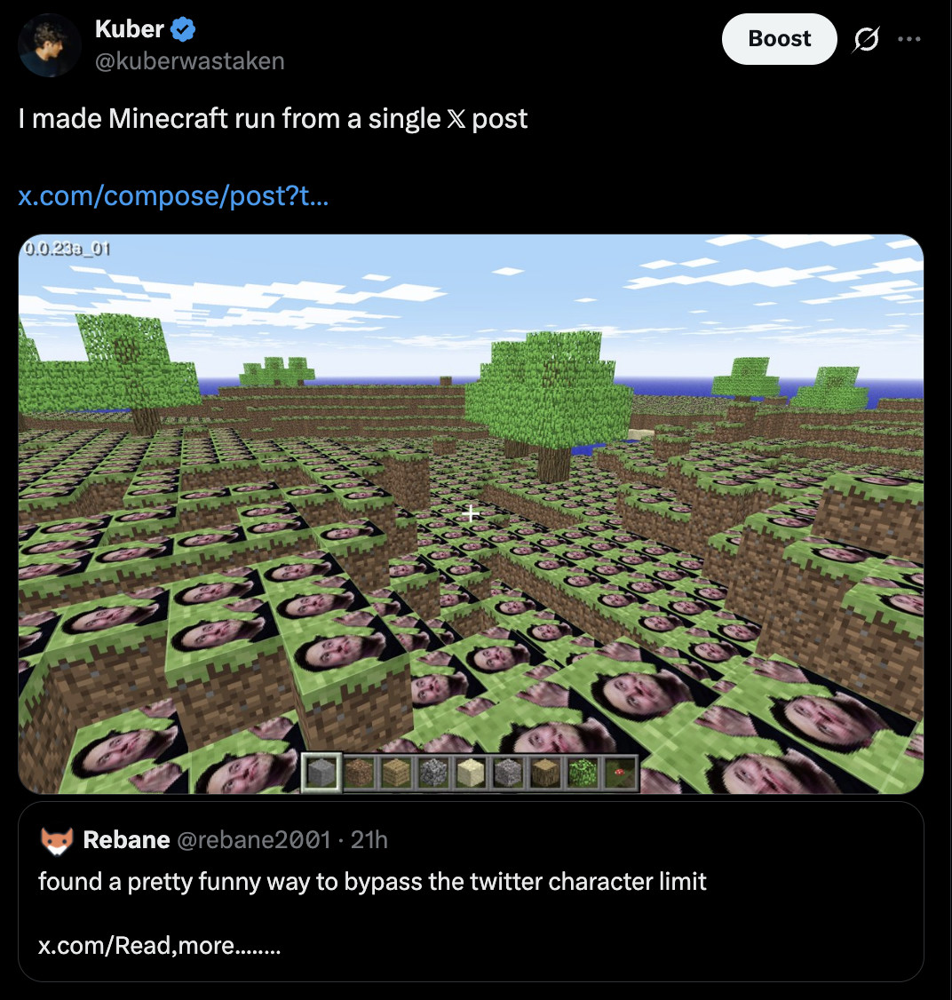

# Minicraft

**A playable copy of Minecraft Classic, hidden inside a single X thread.**

[](https://x.com/kuberwastaken/status/2073746364228673886)

I found this rather cool trick from **[@rebane2001](https://x.com/rebane2001)** on twitter yesterday that reminded me that I was working on this "hard problem" I left 3 months ago of running Minectaft from a tweet.

If you do x.com/compose followed by the URL string on your post itself, it'll open up the compose box with those words clearly printed out! Using this I was able to truncade the instructions and my custom decoder (because it's ~20 tweets that need to be consolidated) base64 encoded

Is it useful? No, is it a really fun sunday hack that made me smile? sure

▶️ **[See it live on X →](https://x.com/kuberwastaken/status/2073746364228673886)**

---

## Play it

Three ways, easiest first:

1. **Just play** → **[kuber.studio/minicraft](https://kuber.studio/minicraft)**
2. **From the thread:** open tweet 2's link, copy the `data:text/html;base64,…` line
   it shows, and paste it into your browser's address bar → that's the decoder. Hit
   **auto-fill from github**, then **Play**.
3. **By hand:** in the decoder, paste tweets 3–20 (the raw chunks) yourself, then Play.

---

## How it works

The game is ~9 MB of HTML/JS. A thread is ~20 posts. The squeeze:

| stage | size |
|---|---:|
| original monolithic game (`index.html`) | 9.2 MB |
| re-minified, JS-aware (`minified-index.html`) | 4.47 MB |
| Babylon.js tree-shaken + dead crypto stripped (`game-shaken.html`) | 2.35 MB |
| **LZMA compressed** | **320 KB** |
| base64url text | ~427 K chars |
| **→ 18 game posts + 1 decoder + 1 intro** | **20 tweets** |

The layout of the thread:

- **Tweet 1** — the intro (a compose link that opens the write-up).
- **Tweet 2** — the **decoder**: a `data:text/html` page, deflate-compressed and wrapped
  in a self-inflating bootstrap so the whole thing (a UI *plus* an embedded LZMA engine)
  fits in one post. Works fully offline.
- **Tweets 3–20** — the game itself, as raw `base64url(LZMA)` text. X Premium's 25 K-char
  limit lets each post carry a big chunk **directly** — no links needed.

The decoder gathers the parts (paste them, or one-click **auto-fill from github**),
base64url-decodes, LZMA-decompresses, and `document.write`s the game. A `localStorage`
shim is injected first, because the game needs storage and `data:` URLs disable it.

---

## What's where

```
game-shaken.html          the shipped game — Babylon tree-shaken, crypto-stripped, Elon-grass
index.html                original monolithic Minecraft Classic (unminified, 9 MB)
minified-index.html       the full game, re-minified with a JS-aware minifier
tweet.txt                 the v1 approach — bytes hidden as invisible Unicode variation selectors
font/                     bitmap font the game uses
TWEETS/                   the postable thread — tweet-001..020.txt + manifest.txt
unlinked-tweets/          the decoded text= of each tweet (for local testing without X)
FINDINGS.md               empirical notes (WAF behaviour, URL limits, compression)

scripts/
  build_thread.py         game.lzma  ->  TWEETS/ + unlinked-tweets/  (builds the thread)
  build_decoder.mjs       decoder_page.html  ->  self-inflating decoder_bootstrap.html
  decoder_page.html       decoder source (UI + embedded LZMA engine)
  decoder_bootstrap.html  the built decoder, embedded in tweet 2
  lzma-d-min.js           LZMA decode engine (shipped inside the decoder)
  intro.txt               tweet 1 text  (edit this — not the generated TWEETS/)
  compose_link.py         any text/file  ->  an x.com/compose/post link
  encode.py / decode.py   v1: hide bytes as Unicode variation selectors
  thread_pack.py / _unpack generic file <-> deflate-thread helpers
```

**Editable sources:** `scripts/intro.txt` (tweet 1), `scripts/decoder_page.html` (the
decoder), and `game-shaken.html` (the game — e.g. textures). `TWEETS/` and
`unlinked-tweets/` are **generated** — regenerate them with `build_thread.py`.

---

## The journey (a.k.a. everything that went wrong)

It started as *"can we make the broken minified build run"* and turned into a
compression / X-limits rabbit hole. Highlights:

- **The minifier that ate a regex.** `minified-index.html` threw
  `Uncaught SyntaxError: Invalid regular expression flags`. A naïve minifier had seen the
  `//` inside a `/\//g` regex, mistaken it for a line comment, and deleted the rest of the
  line. Re-minified with a JS-aware tool.

- **The compose-link rabbit hole.** A link to `x.com/compose/post?text=…` opens a
  pre-filled composer. But X's WAF **403s** any URL containing `<script` (so payloads are
  base64), and the URL **431s** past ~14 K chars — dropping to ~10 K once a logged-in
  browser's cookies are added. All measured against x.com directly.

- **base64url.** Standard base64's `+ / =` get %-expanded 3× inside a URL. base64url
  (`A–Z a–z 0–9 - _`) is URL-safe with zero expansion — 6 bits/char, the density ceiling.

- **The white screen.** The decoder booted from `file://` in tests but **white-screened
  as a real `data:` URL** — the game reads `localStorage`, which is disabled in opaque
  `data:` origins. Fixed by injecting an in-memory storage shim before the game runs.

- **Babylon.js is 69% of the game.** The bundle's biggest module is Babylon.js 4.0.3
  (2.37 MB), but the game only touches **26** of its APIs. Tree-shaking it to that surface
  (→ 806 KB), plus stripping a dead crypto polyfill (elliptic / bn.js, dragged in by a
  single `randomBytes` call), roughly **halved** the game — verified still booting,
  rendering, and opening menus in headless Chrome.

- **Beating deflate.** Browsers only inflate gzip/deflate natively — but the decoder
  ships its own engine, so **LZMA** (−25% vs deflate) does the compression, wrapped so the
  decoder still fits in one tweet.

- **The Premium plot twist.** The compose-link trick beats the *280-char free limit* — but
  X Premium already grants 25 K chars per post. So for the game data, **posting raw text
  directly beats links** (no ~10 K URL cap): **45 → 20 tweets.**

- **GitHub Pages hated us.** Legacy Jekyll choked on the huge inlined-HTML files (stuck
  builds, failed deploys). A one-line `.nojekyll` → serves static, builds in ~15 s.

- **Elon grass.** Because why not. Swapped the `grass` entry (16×16 green) in the game's
  `__TEX__` table for a 64×64 render and re-ran the pipeline. Cost: +1 tweet.

The full measured notes live in **[`FINDINGS.md`](FINDINGS.md)**.

---

## Credits & legal

- Minecraft is © **Mojang / Microsoft**. This is an unaffiliated technical-art demo, not
  endorsed by them.
- The compose-link trick: **[@rebane2001](https://x.com/rebane2001)**.
- [Minecraft Classic Forever](https://github.com/ManiaDevelopment/Minecraft-Classic-Forever) - Goats for helping me find the actual source to play with
- Made with funmaxxing by **[Kuber Mehta](https://kuber.studio)**.
